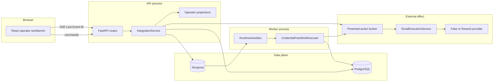
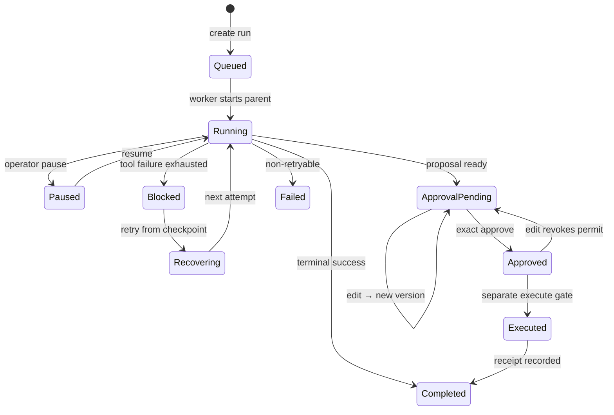
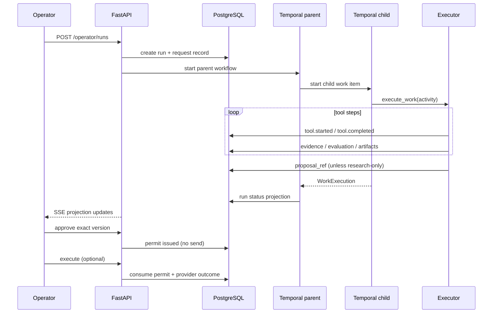

# Sentinel architecture

How the system is actually shaped: control plane, durability, trust boundaries,
and the run lifecycle. This matches the implemented monorepo, not a wishlist.

**Operator demo:** [Loom recording](https://www.loom.com/share/ba9d47061d23472b984e361d1abaf923)

## 1. Problem split

```text
┌────────────────────────────┐     ┌────────────────────────────┐
│  Engine (smaller half)     │     │  Harness (product)         │
│  deep enough work to render│     │  legibility · control      │
│  nested tools + one child  │────►│  recovery · exact approval │
│  credential-free by default│     │  deliverables · SSE        │
└────────────────────────────┘     └────────────────────────────┘
```

The assignment grades the right-hand box. The left exists so the right has real
structure under load.

## 2. Runtime topology



| Process | Owns |
|---|---|
| `sentinel-api` | HTTP, SSE, command ingress, projections, approve/execute gate |
| `sentinel-worker` | Temporal workflows and activities |
| Postgres | Journal, projections, integration records, permits, email outcomes |
| Temporal | Parent/child history, updates, replay, cancellation |

## 3. Workbench layout (operator projection)

```text
┌────────────┬───────────────────────────────────┬────────────────┐
│ Sessions   │ Run header                        │                │
│ history    │ phase · revision · autonomy       │                │
│ disclosure │ pause / resume                    │                │
├────────────┼─────────────────┬─────────────────┼────────────────┤
│            │ Work tree       │ Evidence canvas │ Action rail    │
│            │ phase           │ comparison      │ artifacts      │
│            │  └ subagent     │ claims          │ RFQ proposal   │
│            │     └ work      │ requirements    │ preview / diff │
│            │        └ tools  │                 │ approve        │
│            │                 │                 │ execute (sep.) │
├────────────┴─────────────────┴─────────────────┴────────────────┤
│ Operator instructions: queue | redirect                         │
└─────────────────────────────────────────────────────────────────┘
```

Projections are built server-side from the journal + records. The browser is not
the source of truth; reconnect restores from durable run ID and `Last-Event-ID`.

## 4. Run lifecycle



Redirect mid-flight creates a new request revision, invalidates dependent
evaluation/artifacts/proposal, and selectively retains candidate/evidence
records when the dependency graph allows it.

## 5. Parent / child execution



Default integrated child is one broad end-to-end work item (~60 tool lifecycle
events). The runtime model supports multiple work items; the demo spends depth
on control surfaces rather than fan-out breadth.

## 6. Trust boundary for external effects

```text
                    ┌─────────────────────────────────────┐
                    │ Research / evaluation path          │
                    │ (tainted content, no credentials)   │
                    └─────────────────┬───────────────────┘
                                      │ produces proposal bytes
                                      ▼
                    ┌─────────────────────────────────────┐
                    │ Proposal versions                   │
                    │ canonical JSON + attachment digests │
                    └─────────────────┬───────────────────┘
                                      │ operator edit / approve
                                      ▼
                    ┌─────────────────────────────────────┐
                    │ ApprovalPermit                      │
                    │ version · digests · policy · expiry │
                    │ single-use nonce                    │
                    └─────────────────┬───────────────────┘
                                      │ authorize_and_consume
                                      ▼
                    ┌─────────────────────────────────────┐
                    │ EmailExecutionService               │
                    │ recheck controlled recipient        │
                    │ CAS outcome state machine           │
                    └─────────────────┬───────────────────┘
                                      │
                          ┌───────────┴───────────┐
                          ▼                       ▼
                     Fake provider           Resend transport
                     (default)               (live-approved gate)
```

Hard rules:

1. Approval never dispatches.
2. Research code never receives the email provider.
3. Execution requires a live permit for the exact current version.
4. Ambiguous outcomes block blind retry.

## 7. Autonomy (policy overlay, plain language)

```text
research_only ──────────► artifacts + ranking only; no RFQ path
ask_before_external ────► full path; approve required; no auto-send   (default)
approve_and_hold ───────► approve allowed; dispatch still separate
```

Stored as durable `autonomy_mode` records. Completed runs may only tighten to
`research_only`.

## 8. Data ownership

| Store | Contents |
|---|---|
| Event journal | Ordered run events; SSE source; rebuild projections |
| Integration records | Request revisions, candidates, evidence, artifacts, decisions |
| Protected-action tables | Proposals, versions, permits, intents, outcomes |
| Email execution store | CAS transitions, provider fingerprints, sanitized receipts |
| Temporal history | Workflow progress, updates, activity retries |

Artifacts in the integrated path currently live as bytes on integration records.
Compose includes MinIO for the intended object-store topology; swapping storage
is an adapter change, not a product redesign.

## 9. Package layout

```text
apps/api/src/sentinel_api/
  domain/              immutable contracts, policy, invalidation
  persistence/         journal, migrations, postgres adapters
  workflows/           Temporal parent/child, activities, failures
  integration/         planner, executor, projections, service
  protected_actions/   broker, canonical digests, permits
  email/               execution service, fake + Resend
  evaluation/          normalization + ranking
  research/            taint/isolation, Agent Reach client, discovery heuristics
  routes/              HTTP + SSE
apps/web/src/          structural workbench only
```

API and worker both construct `CredentialFreeWorkExecutor` with the same research
provider and controlled recipient so Temporal activities cannot silently fall
back to fixtures while the API discloses live mode.

## 10. Failure classes (designed states)

| Class | Operator-visible outcome |
|---|---|
| Transient / rate limit | Blocked branch + retry from checkpoint when safe |
| Policy / auth denial | Non-retryable blocker; no unsafe retry control |
| Worker death | UI stops advancing; history intact; restart resumes workflow ID |
| Tab close / SSE drop | Restore run; resume after last event id |
| Edit after approve | New version; prior permit unusable |
| Provider unknown | No second send until reconciliation |

## 11. What is intentionally not in the critical path

- Negotiated quotes / verified commercial availability (live research is public
  search + page read heuristics via Agent Reach, not RFQ responses)
- LLM planner in the integrated executor
- Multi-user auth, RBAC UI, multi-tenant hosting
- ERP write-back, payments, PO placement

Default research provider is `agent_reach` (Exa via mcporter + Jina Reader).
`fake` fixtures remain for CI. The architecture keeps seams (provider
interfaces, broker, Temporal activities) so paid market data or LLM planning
can attach without rewriting the operator control plane.
