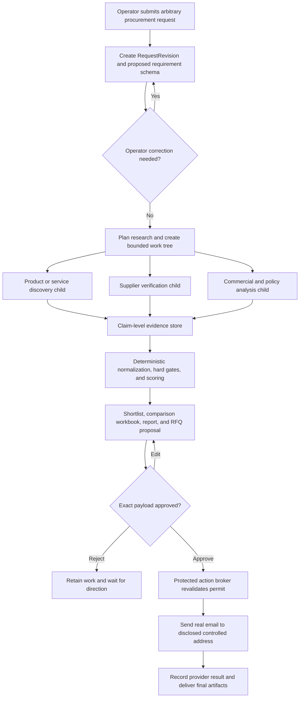

# Production Procurement Agent Architecture for the X-ARC Harness

Date: 2026-07-29  
Status: architecture recommendation before implementation

## Executive decision

Build a category-generic procurement operator named **Sentinel**. It accepts arbitrary requests for goods or services, turns each request into a typed requirement model at runtime, finds and verifies real public evidence, compares candidates deterministically, produces usable procurement artifacts, and performs an approved external action.

The demo action will be real: Sentinel sends the approved RFQ package only to a clearly disclosed throwaway address controlled by the project owner. It will not pretend to contact a supplier.

Recommended production stack:

- React + TypeScript operator workbench with deterministic, domain-specific views
- FastAPI and Pydantic models for the application/API boundary
- Pydantic AI for typed agent and tool interfaces
- Temporal for durable parent/child workflows, acknowledged operator commands, cancellation, retries, and recovery
- PostgreSQL for procurement state, approvals, an append-only product event journal, and UI projections
- S3-compatible object storage for immutable evidence and versioned artifacts
- SSE with resumable event IDs for browser updates; normal authenticated HTTP endpoints for commands
- A thin Browser Harness-inspired browser broker using Playwright’s reliable locators and raw CDP as the escape hatch
- Cedar-style deterministic authorization at the protected-action boundary
- OpenTelemetry for engineering diagnostics, kept separate from the product audit journal
- Resend as the preferred email connector when a verified domain is available; Gmail OAuth as a supported fallback

This is not a universal autonomous buyer. The supported envelope is deliberately precise: any procurement category may enter the same intake, research, comparison, artifact, approval, and RFQ-send lifecycle. Restricted categories, missing evidence, inaccessible suppliers, or policies that require a human may block or escalate rather than being guessed around.

## Why the product is generic without becoming vague

“Any procurement request” should not mean one prompt with no domain model. It should mean a stable procurement language plus request-specific schemas.

The stable model contains:

- `ProcurementCase`
- `RequestRevision`
- `Lot` and `LineItem`
- `Requirement` and `Criterion`
- `CategorySchema`
- `Supplier`
- `Offering` or `Quote`
- `EvidenceObservation`
- `Evaluation`
- `Proposal`
- `ActionIntent`
- `ApprovalPermit`
- `Artifact`
- `OrganizationPolicy`
- `RequestPolicyOverlay`

Each criterion has a type such as boolean, enum, number with unit, money, date, geography, certification, text, or evidence-backed assertion. It also records whether it is mandatory or preferred, how it is evaluated, and what evidence is acceptable.

At runtime Sentinel:

1. Parses the operator's request.
2. Proposes a category-specific attribute schema.
3. Lets the operator correct the schema and requirements.
4. Freezes a versioned request snapshot.
5. Uses that snapshot to research and evaluate candidates.

The agent therefore does not contain a laptop workflow, packaging workflow, or catering workflow. Those are data instances of the same lifecycle.

[UNSPSC](https://www.unspsc.org/) provides a cross-industry classification vocabulary. [OASIS UBL](https://docs.oasis-open.org/ubl/UBL-2.4.html) provides generic procurement document concepts, including a [Request for Quotation](https://docs.oasis-open.org/ubl/cs01-UBL-2.4/mod/summary/reports/UBL-RequestForQuotation-2.4.html). [OCDS](https://www.open-contracting.org/data-standard/) is useful vocabulary for planning, tender, award, contract, and implementation. Sentinel should borrow these semantics but keep an ergonomic internal model rather than forcing every screen and tool to manipulate standards XML.

## Configuration precedence

Policy is data and code, not prompt text. The effective configuration is merged in this order:

1. **Platform invariants** — cannot be weakened, such as no action executor inside an untrusted browser agent.
2. **Organization policy** — roles, approval matrix, spend limits, allowed regions, required supplier evidence, retention, and restricted categories.
3. **Request overlay** — budget, currency, delivery location, scoring weights, source freshness, allowed actions, and run-specific constraints.

The request overlay may tighten an organization rule but cannot weaken it. Only an authorized administrator may change organization policy.

This satisfies per-user/per-request configurability without allowing a requester to self-remove mandatory controls.

## End-to-end run



Independent research branches run concurrently. A subagent is used only when the branch has its own goal, tool scope, browser session, lifecycle, and structured result. A tool call with an anthropomorphic label is not counted as a subagent.

## Assignment acceptance matrix

| Assignment requirement | Architecture acceptance criterion | Demo proof |
|---|---|---|
| New agent/domain | Procurement lifecycle and Sentinel's prior domain are documented; no reuse of the previous agent's domain | Memo names both domains |
| Long, deep run | A real run performs more than 20 recorded tool calls across search/fetch, browser, procurement, evidence, artifact, policy, and email namespaces | Run tree and event count |
| Several tool namespaces | Tool registry exposes stable, typed namespaces and records namespace/tool/version | Filterable activity view |
| At least one subagent | At least one genuine Temporal child workflow has isolated tools and a structured result | Expandable parent/child tree |
| Current activity and completed work | Server projections expose active work, completed work, known remaining work, and blockers | Glance view |
| Rough progress | Progress comes from the current plan/work tree, never an invented model percentage | Phase plus “verified 3 of 5” counters |
| Grouping, nesting, summarizing, collapsing | Events project into phases, work items, subagents, tools, evidence, and artifacts | Three-level drill-down |
| Interrupt | Pause stops scheduling new activities and requests cooperative cancellation of cancellable work | Pause during research |
| Redirect without losing work | A new request revision invalidates only dependent work; unaffected evidence remains | Add a constraint mid-run and show retained findings |
| Queue a message | Operator command is durably queued, ordered, acknowledged, and visible before application | Queue constraint while a child is busy |
| Understandable autonomy | Effective policy and action risk are visible; protected effects cannot be invoked by research agents | Policy drawer and tool capability badges |
| Inline approval | Proposal is a first-class pending state within the run, not a modal interruption | RFQ approval card |
| Editable proposal | Editing creates a new proposal version and invalidates the old permit | Edit recipient or body before approving |
| Preview/diff | UI renders exact canonical payload and attachment hashes; versions have a semantic diff | v1 → v2 diff |
| Post-action audit | Result stores who approved, what digest was approved, connector response, timestamps, and outcome | Sent action receipt |
| Close/reopen | Durable execution and stored projections are independent of the browser tab | Close and reopen during work |
| Tool/model/run failures | Failures are classified, surfaced, retried only when safe, and never silently converted to success | Kill a real worker/browser process and resume |
| Resume/retry without zero | Temporal recovers completed steps; artifact/evidence IDs are stable | Completed calls remain completed |
| Past sessions | PostgreSQL session index and projections are queryable without replaying raw logs | Session history screen |
| Usable files/results | Versioned comparison workbook, evidence-backed report, RFQ package, and action receipt are downloadable | Open files from artifact rail |
| Public GitHub and real history | Small coherent commits; no squashed fake history | Repository log |
| Raw coding-agent traces | Development traces are saved under `traces/` and secrets are redacted | Repository folder |
| Maximum two-page memo | Memo covers operator, cuts, rendering choice, failures, metric, and stubs | PDF page count |
| Operator-perspective video | Video shows hard run, control, approval, failure, recovery, and artifact | No code walkthrough |
| Non-cliché visual taste | Purpose-built procurement workbench; no generic chatbot/dashboard template | Final UI |
| Disclose stubs | Any local-only, demo-only, or unimplemented production adapter is named precisely | Memo “production gaps” section |

## Layer decisions

### 1. Operator interface

Use a deterministic workbench, not model-generated HTML and not chat as the primary surface.

The default screen should have:

- A compact run header: state, elapsed time, request revision, active policy, and high-level controls
- A left work tree: phases, subagents, work items, blockers, and retry states
- A central evidence/comparison canvas: requirements, candidate table, evidence drawer, and conflicts
- A right artifact/action rail: reports, workbook, proposals, approval status, and action receipts
- A small command composer for redirecting or queuing instructions

Information has three levels:

1. Glance: what is happening, what finished, what is blocked, what remains.
2. Inspect: grouped work, subagents, evidence, proposals, failures.
3. Debug: raw typed tool input/output references, retry metadata, and trace links.

Raw chain-of-thought is never displayed. The UI shows observable work, short agent-authored status summaries, decisions, evidence, and results.

[Magentic-UI](https://arxiv.org/abs/2507.22358) supports co-planning, action guards, and other low-cost human involvement mechanisms. [AG-UI](https://docs.ag-ui.com/) is a useful compatibility envelope for lifecycle, tool, state snapshot, and custom events. Sentinel may emit AG-UI-compatible lifecycle events, but its procurement events and projections remain application-owned so the interface is not constrained to chat semantics.

### 2. Durable orchestration

Use one Temporal parent workflow per procurement run. Model/API/browser/document/email operations are Activities. Independent research agents are Child Workflows.

Use Temporal Updates for `pause`, `resume`, `redirect`, `queue_message`, `approve`, and `reject`. An Update may validate, mutate workflow state, return an acknowledged result, and record acceptance in history. A Signal only confirms server receipt, not that workflow code accepted the command. [Temporal Python message passing](https://docs.temporal.io/develop/python/workflows/message-passing)

Pydantic AI has native Temporal durability that moves model, tool, and MCP I/O into Activities while leaving orchestration in deterministic workflow code. [Pydantic AI Temporal integration](https://pydantic.dev/docs/ai/capabilities/durable_execution/temporal/)

Temporal is chosen over DBOS for this project because acknowledged commands, child lifecycle, cancellation propagation, replay testing, and mature failure semantics are central product requirements. DBOS is a credible leaner alternative and has excellent Postgres-backed durable messaging and human waits, but Temporal gives the stronger control plane when implementation cost is not the main criterion. [DBOS human-in-the-loop](https://docs.dbos.dev/ai/hitl)

Temporal history is execution truth, not the operator-facing audit model. Large payloads are stored externally and Activities pass compact typed references.

### 3. Revision-aware preservation

Every work product records:

- request revision used
- policy revision used
- input evidence IDs
- dependency edges
- producer agent/tool version

A redirect creates `RequestRevision n+1`. A deterministic invalidation service compares changed fields with dependency edges:

- Raw fetched evidence normally remains valid.
- Extracted observations remain valid if their source and schema field still apply.
- Scores, rankings, recommendations, proposals, and approvals are recomputed or invalidated when their inputs change.
- Completed unrelated branches stay complete.

This is how “redirect without losing work” becomes a real invariant instead of “put the old transcript back in the prompt.”

### 4. Browser and research substrate

Use the intent of the original 592-line Browser Harness:

- very small browser-control core
- direct, inspectable primitives
- raw CDP/Python escape hatch
- agent-created procedural helpers when existing helpers are insufficient
- a persistent browser service for the duration of a run

Production hardening:

- The broker/core is read-only to agents.
- Prefer direct HTTP/API fetch when possible; escalate to a browser only when interaction or rendering is necessary.
- Use Playwright role/text/label locators and auto-waiting for routine actions. [Playwright auto-waiting](https://playwright.dev/docs/actionability)
- Give every subagent an isolated browser context. [Playwright BrowserContext](https://playwright.dev/docs/api/class-browsercontext)
- Never attach agent code to the operator's default Chrome profile. Chrome documents the credential risk of remote debugging and now requires a non-default profile for this use. [Chrome remote-debugging security](https://developer.chrome.com/blog/remote-debugging-port)
- Run agent-authored helpers in an isolated sandbox behind a capability-limited browser RPC.
- Per-run helper patches are retained as artifacts, not silently promoted into production.
- Promotion to a reusable skill requires tests, review, a capability manifest, locked dependencies, and a content digest.

For a true multi-tenant production deployment, Firecracker is the strongest isolation boundary for agent-written code; gVisor is a lower-overhead alternative. [Firecracker design](https://github.com/firecracker-microvm/firecracker/blob/main/docs/design.md), [gVisor security model](https://gvisor.dev/docs/architecture_guide/security/)

### 5. Tool and capability system

Suggested namespaces:

- `search.*` — discover public sources
- `fetch.*` — retrieve HTTP documents
- `browser.*` — interactive browsing and downloads
- `procurement.*` — requirements, classification, normalization, evaluation
- `evidence.*` — observations, conflicts, provenance, freshness
- `artifact.*` — reports, workbook, RFQ package
- `policy.*` — evaluate authorization and approval requirements
- `email.*` — prepare and execute controlled sends

Every tool declares:

- typed input/output schema
- semantic version
- risk class: read, internal write, external send, spend, destructive
- allowed actor/capability
- timeout and retry policy
- idempotency behavior
- whether it accepts untrusted data
- whether it is a protected sink

Research subagents receive read-only capabilities. They never receive email credentials, database credentials, or protected-action tools.

### 6. Evidence, provenance, and truthful data

Every material claim is an `EvidenceObservation` with:

- value and normalized unit/currency
- classification: operator-provided, observed, calculated, inferred, conflicting, or unknown
- source URL/document and retrieval time
- exact text/table span or structured field
- content hash and response/screenshot reference
- extractor and schema version
- freshness and confidence state

W3C PROV's entity/activity/agent and derivation concepts are a sound basis for claim lineage. [W3C PROV-O](https://www.w3.org/TR/prov-o/) URLs alone are not enough because price, stock, terms, and pages change.

The LLM may propose a schema, extract a candidate observation, or explain a comparison. Deterministic code:

- normalizes units and currencies
- applies hard constraints
- calculates totals and taxes
- computes weighted scores
- checks evidence coverage
- renders approved payload bytes

No unsupported value is silently filled. The UI shows `unknown` or `conflicting` and explains what evidence is missing.

### 7. Approval and protected execution

Approval authorizes one exact action, not a general intention.

An approval permit contains:

- proposal ID and version
- action type
- canonical payload digest
- attachment/artifact digests
- policy decision ID and risk class
- approver identity
- approval and expiry times
- single-use nonce

The preview is rendered from the same canonical payload that will be executed. JSON can be canonicalized according to [RFC 8785](https://www.rfc-editor.org/info/rfc8785/) before hashing.

Editing creates a new proposal version. The old approval cannot authorize the new bytes.

At commit time the protected action broker rechecks:

- operator identity and role
- effective platform/org/request policy
- proposal version and digest
- permit freshness and nonce
- recipient allowlist/demo constraint
- attachment digests
- connector configuration

This is important because authority can become stale between approval and execution; the 2026 paper [Temporary Authority, Permanent Effects](https://arxiv.org/abs/2607.10487) argues for commit-time authorization bound to the same effect.

Use a deterministic policy engine such as Cedar at this boundary. Cedar supports principal/action/resource/context authorization and forbid-overrides. [Cedar authorization](https://docs.cedarpolicy.com/auth/authorization.html)

### 8. External-action outcome model

Never collapse a timeout into “failed.” Use:

```text
PREPARED
  → PENDING_APPROVAL
  → APPROVED
  → DISPATCHING
      → CONFIRMED
      → FAILED_BEFORE_EFFECT
      → OUTCOME_UNKNOWN
          → RECONCILING
              → CONFIRMED | SAFE_TO_RETRY | NEEDS_OPERATOR
```

Every mutating request receives a stable idempotency key and payload fingerprint. This follows the [IETF Idempotency-Key draft](https://datatracker.ietf.org/doc/html/draft-ietf-httpapi-idempotency-key-header) and AWS guidance on safe retries and ambiguous outcomes. [AWS Builders' Library](https://aws.amazon.com/builders-library/making-retries-safe-with-idempotent-APIs/)

For email:

- Prefer Resend when a verified sending domain is available. Its API supports payload-bound idempotency keys and returns the original response for a same-key retry within its retention window. [Resend idempotency keys](https://resend.com/docs/dashboard/emails/idempotency-keys)
- Support Gmail OAuth when no domain is available. Gmail supports draft/send but has no documented idempotency-key parameter, so use a deterministic RFC Message-ID, proposal identifier, stored draft/message identifiers, and reconciliation before retry. [Gmail draft send](https://developers.google.com/workspace/gmail/api/reference/rest/v1/users.drafts/send)

The demo recipient is an organization/request configuration value, visibly labeled “controlled demonstration recipient.” The email provider result is real and stored.

### 9. Security and prompt injection

Assume untrusted webpages and documents can contain successful prompt injections. Detection is useful telemetry, not the security boundary.

[AgentDojo](https://arxiv.org/abs/2406.13352) demonstrates attacks delivered through untrusted tool data. [OWASP's prompt-injection guidance](https://cheatsheetseries.owasp.org/cheatsheets/LLM_Prompt_Injection_Prevention_Cheat_Sheet.html) recommends least privilege, remote-content controls, and monitoring. Chrome's security architecture research also separates untrusted content processing from privileged action decisions. [Google Security Blog](https://blog.google/security/architecting-security-for-agentic/)

Required controls:

- label external content as untrusted
- preserve taint/provenance through subagent results
- no credentials or protected sinks in research contexts
- domain and egress restrictions
- separate browser session per subagent
- deterministic policy at every sink
- exact approval for send/upload/spend/delete
- secret redaction in prompts, events, screenshots, and traces
- adversarial tests with instructions hidden in HTML, PDFs, images, and tool results

For production identity, use OIDC Authorization Code with PKCE, secure HttpOnly/SameSite cookies, role and attribute checks, and PostgreSQL Row-Level Security as a second tenant boundary. [OAuth 2.0 Security Best Current Practice](https://www.rfc-editor.org/info/rfc9700/), [PostgreSQL row security](https://www.postgresql.org/docs/current/ddl-rowsecurity.html)

### 10. Product event journal, projections, and realtime delivery

Do not event-source the entire product. Use normal relational current-state tables plus an append-only journal for runs, decisions, approvals, revisions, failures, and external effects.

Minimum journal envelope:

```text
event_id
run_id
per_run_sequence
parent_run_id
work_item_id
actor_id
event_type
status
causation_id
correlation_id
summary
payload_ref
created_at
```

The same database transaction updates current state and appends an outbox/event record. Consumers are idempotent because transactional outbox delivery may be at least once. [AWS transactional outbox](https://docs.aws.amazon.com/prescriptive-guidance/latest/cloud-design-patterns/transactional-outbox.html)

Server-side projections provide fast reads for:

- run summary
- work tree
- subagents
- approvals
- evidence coverage
- artifacts
- failures and retries

SSE messages use the per-run sequence as `id`. On reconnect, `Last-Event-ID` allows replay of missed durable events before live delivery continues. [WHATWG SSE specification](https://html.spec.whatwg.org/dev/server-sent-events.html)

### 11. Artifacts

Expected outputs:

- requirements specification
- supplier/candidate comparison workbook
- evidence-backed recommendation report
- RFQ email body and attachment package
- action receipt and audit summary

Each artifact version has:

- stable artifact ID and explicit version
- object key
- MIME type and size
- SHA-256 digest
- source run/event and request revision
- producer
- approval version where relevant
- creation time

Approved artifacts are immutable. Any edit creates a new version. Object-store versioning is defense in depth, not a substitute for application-level versions. [Amazon S3 Versioning](https://docs.aws.amazon.com/AmazonS3/latest/userguide/Versioning.html)

### 12. Failure taxonomy

Failures are designed states:

- `TRANSIENT` — bounded automatic retry with jitter
- `RATE_LIMITED` — obey provider retry timing
- `AUTH_REQUIRED` — operator/integration action needed
- `POLICY_DENIED` — explain which rule denied it
- `INPUT_REQUIRED` — missing decision or ambiguity
- `SOURCE_CHANGED` — evidence must be refreshed/re-extracted
- `CONFLICT` — evidence disagrees
- `TOOL_BUG` — retry only after a different strategy/version
- `MODEL_INVALID_OUTPUT` — schema retry, then escalation
- `OUTCOME_UNKNOWN` — reconcile before any repeated side effect
- `TERMINAL` — no safe continuation

The strongest demo failure is a real process failure: terminate a browser or worker process during a live run, show the designed failed/recovering state, restart it, and resume with completed work intact. This is more honest and more impressive than printing a scripted “500 error.”

### 13. Testing and evaluation

Four test layers:

1. Pure domain/state-machine tests for revisions, invalidation, scoring, policy, permits, and outcomes.
2. Workflow integration tests with Temporal's test environment and replay of saved histories.
3. Real-infrastructure fault tests for worker death, browser death, lost SSE, timeout-after-effect, and connector retry.
4. Playwright operator-journey tests for pause, redirect, queue, approval edit/diff, close/reopen, retry, history, and artifact download.

Required adversarial and correctness cases:

- prompt injection on a supplier page tries to invoke email
- a request edit invalidates ranking but retains source evidence
- an approved proposal is edited and the old permit is rejected
- parent cancellation propagates to active children
- one child fails while siblings complete
- browser and worker processes die and recover
- duplicate action retries produce one email
- an ambiguous connector timeout enters reconciliation
- SSE reconnect replays exactly the missed events
- projections rebuild from the journal
- unsupported facts remain unknown

Genericity evaluation should include genuinely different requests, for example office hardware, an industrial component, packaging, a SaaS service, and a local service. Test fixtures may be synthetic inside automated tests, but the recorded demo and submission claims use real public sources and real connector results.

Primary product metric: **decision-ready completion rate** — the fraction of eligible procurement runs that produce a policy-compliant shortlist and usable artifact set with every mandatory criterion either supported by evidence or explicitly marked unresolved, without an unapproved or duplicate external effect.

Guardrail metrics:

- mandatory-criterion evidence coverage
- unsupported-claim rate
- duplicate external-effect rate
- crash-resume success rate
- operator-command acknowledgement latency
- approval payload mismatch attempts blocked
- prompt-injection sink escape rate

### 14. Latency, quality, and cost

Quality and safety take priority over cheap execution.

Still use structural efficiency:

- run independent research children concurrently with bounded per-domain concurrency
- prefer HTTP/API retrieval before full browser automation
- stream durable high-level events immediately
- keep large evidence outside model/workflow histories
- use artifact references and focused summaries instead of replaying the entire transcript
- do arithmetic, normalization, policy, and ranking in deterministic code
- use a strong model for planning, schema creation, conflict resolution, and final synthesis
- use smaller/faster models for extraction only after evals prove they meet the schema and evidence requirements
- cache immutable content by digest inside a run; do not reuse volatile price/availability facts without a freshness check
- separate browser, model, document, and protected-action worker pools

Agent loops have explicit tool-call, wall-clock, concurrency, and plan-revision budgets to prevent accidental infinite execution. Budgets are operational guardrails, not primarily cost controls.

## Assignment-focused cuts

Do not build these before the core harness works:

- autonomous purchasing or payments
- autonomous supplier negotiation
- a supplier marketplace
- ERP-wide master-data management
- every UBL/OCDS document and lifecycle stage
- mobile or voice operation
- automatic global promotion of agent-authored browser code
- a generic drag-and-drop workflow builder
- model-generated UI

These cuts preserve category-generality while keeping the assignment centered on operating a deep agent.

## Recommended demo

Use one real request that has enough public evidence and objective constraints to require substantial work. The request is only a demo seed, not a special code path.

Sequence:

1. Enter the request and organization/request policy.
2. Review the generated requirement schema.
3. Start a run with multiple real research branches.
4. Expand the run tree and show more than 20 real tool calls across namespaces.
5. Queue a message while a child is busy.
6. Redirect with a new hard constraint; show preserved evidence and selective recomputation.
7. Close and reopen the tab.
8. Terminate a real worker/browser process and recover.
9. Inspect evidence, conflicts, and generated artifacts.
10. Edit the RFQ proposal, making the old version ineligible for approval.
11. Approve the exact new version.
12. Send it to the disclosed throwaway address through the real connector.
13. Show the provider receipt, final artifacts, and past-session entry.

## Remaining owner inputs

Only two owner inputs remain before implementation:

1. State what the previous Sentinel project actually did so the memo can prove procurement is a new domain. If Sentinel is the new procurement product name rather than the previous project name, clarify that.
2. Choose the email connector based on available credentials:
   - Resend with a verified domain is preferred for native idempotency.
   - Gmail OAuth is the practical fallback when no domain is available.

The throwaway recipient itself can be supplied later as a secret/config value and must never be committed to the public repository.

## Source-quality note

The architecture is grounded primarily in official specifications, framework documentation, standards, and peer-reviewed/preprint security research. GitHub implementations and practitioner discussions on Reddit and Chinese developer communities were used as supplementary signals about real operational pain—especially approval fatigue, missing replay, and execution-layer policy—but not as the sole basis for a critical design decision. Search on X did not return dependable source material, so no architecture claim relies on it.
